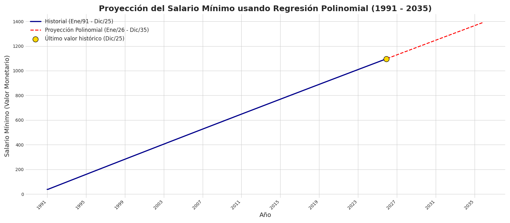
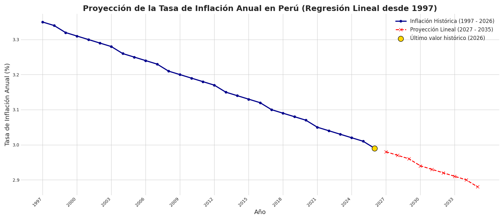
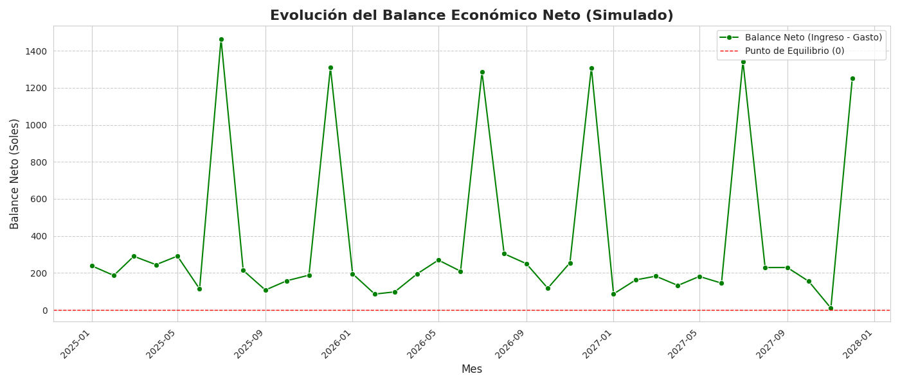
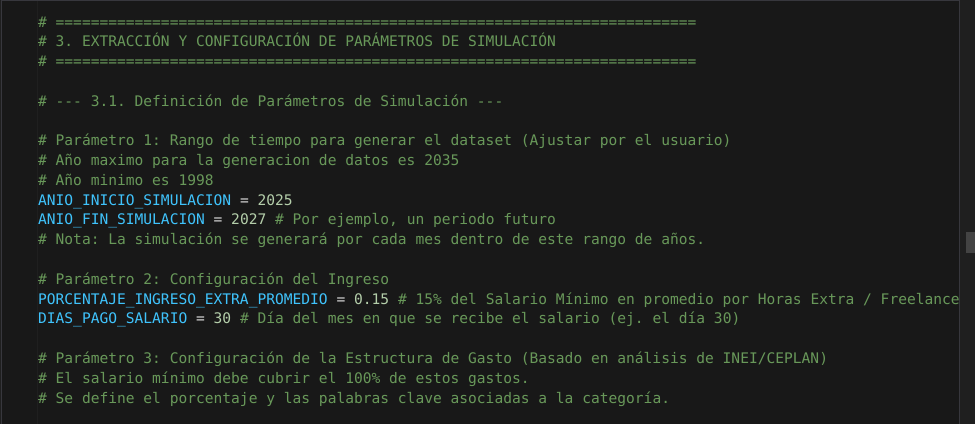

# 💰 GENERADOR DE DATASET SINTÉTICO: GASTOS PERSONALES BASADO EN RMV E INFLACIÓN

## 📋 Resumen del Proyecto

Este proyecto tiene como objetivo generar un **dataset sintético y realista** de transacciones financieras (ingresos y gastos) para un individuo, utilizando como base el **historial y la proyección de la Remuneración Mínima Vital (RMV)** en Perú y la **inflación anual** proyectada.

El dataset simula el comportamiento financiero diario, semanal, mensual y anual de una persona que percibe ingresos cercanos al salario mínimo, incluyendo factores cruciales como las **gratificaciones** de julio y diciembre y la distribución típica del gasto peruano.

El dataset generado es ideal para prácticas y demostraciones de **Ciencia de Datos, Machine Learning (detección de anomalías, categorización) o análisis financiero** en un entorno sin datos sensibles reales.

---

## 🚀 Estructura de Archivos

| Archivo | Descripción |
| :--- | :--- |
| `generator.ipynb` | **Notebook principal.** Contiene todo el código para la carga de datos, limpieza, proyección, configuración de parámetros y la generación del dataset sintético. |
| `historial_salario_minimo.csv` | Datos históricos de la RMV en Perú (mensual). Fuente: BCR. |
| `inflacion_Peru_BCR.csv` | Datos históricos de la Tasa de Inflación (IPC) anual. Fuente: BCR. |
| `proyeccion_salario_minimo.csv` | Output del Paso 2. Proyección de la RMV hasta el año final de simulación (e.g., 2035). |
| `proyeccion_inflacion_BCR_lineal_v3.csv` | Output del Paso 2. Proyección de la Inflación anual. |
| **`dataset_gastos_personales_simulado.csv`** | **Output final del proyecto.** Contiene todas las transacciones sintéticas generadas (fecha, monto, tipo, descripción, categoría) en el periodo simulado. |
| `proyeccion_salario_minimo.png` | Gráfico de la proyección del Salario Mínimo. |
| `balance_mensual_simulado.png` | Gráfico del balance neto (Ingresos vs. Gastos) a lo largo del periodo simulado. |

---

## ⚙️ Metodología y Pasos de Ejecución

El proceso se divide en 4 pasos principales, ejecutables secuencialmente en el notebook `generator.ipynb`:

### 1. Extracción y Limpieza de Datos Históricos
* Se cargan los archivos CSV de historial de RMV e Inflación.
* Se realiza la limpieza de formatos de fecha y la normalización de valores para preparar los datos para la modelización.

### 2. Modelización y Proyección (RMV e Inflación)
* **RMV:** Se aplica una **Regresión Polinomial** al historial de la RMV para proyectar su valor hasta el año final de la simulación (e.g., 2035).
* **Inflación:** Se utiliza una **Regresión Lineal Simple** para proyectar la tasa de inflación anual.
* Los resultados se guardan en `proyeccion_salario_minimo.csv` y `proyeccion_inflacion_BCR_lineal_v3.csv`.

### 3. Configuración de Parámetros de Simulación
* Se define la `ESTRUCTURA_GASTO` (porcentajes por categoría como Alimentación, Vivienda, Transporte).
* Se realiza el crucial *merge* de las proyecciones de RMV (mensual promediada a anual) e Inflación (anual) para obtener un *DataFrame* de proyecciones anuales (`df_proyecciones`).

### 4. Generación del Dataset Sintético (Transacciones)
Se itera mes a mes a lo largo del periodo de simulación, utilizando la función `generar_dataset_financiero_mensual()`:

* **Ingresos:** Se generan ingresos basados en la RMV proyectada para ese año y mes, incluyendo un evento de **Gratificación** (salario extra) en **Julio** y **Diciembre**.
* **Gastos:** Se simulan las transacciones de gasto con alta densidad, siguiendo la `ESTRUCTURA_GASTO` y la periodicidad definida:
    * **Diario/Semanal:** Transporte, Alimentación (Fuera/Hogar).
    * **Mensual:** Vivienda, Servicios, Suscripciones.
    * **Esporádico:** Salud, Vestido, Ocio.
* Se aplica una variación aleatoria controlada (`numpy.random.uniform`) al monto de cada transacción para aumentar el realismo.

---

## 📈 Visualización de Resultados

El proyecto genera dos visualizaciones clave:

### 1. Proyección del Salario Mínimo hasta el año 2035




### 2. Proyección de Inflación hasta el año 2035



### 3. Balance Mensual Simulado

*Muestra el saldo (Ingreso - Gasto) mes a mes, destacando picos de ingreso en los meses de gratificación (Julio y Diciembre).*



## 💻 Requisitos y Dependencias

Para ejecutar el notebook `generator.ipynb`, necesitarás las siguientes librerías de Python:

```bash
pandas
numpy
matplotlib
scikit-learn (sklearn)
random
datetime
os

```

## 🕰️ Configuracion del Periodo de Tiempo
Puedes configurar el periodo de tiempo para generar el dataset sintetico modificando las siguinetes lineas: 

```python
# =========================================================================
# 3. EXTRACCIÓN Y CONFIGURACIÓN DE PARÁMETROS DE SIMULACIÓN
# =========================================================================

# --- 3.1. Definición de Parámetros de Simulación ---

# Parámetro 1: Rango de tiempo para generar el dataset (Ajustar por el usuario)
# Año maximo para la generacion de datos es 2034 
# Año minimo es 1998
# >>> AJUSTAR ESTA LÍNEA (AÑO DE INICIO)
ANIO_INICIO_SIMULACION = 2025  
# >>> AJUSTAR ESTA LÍNEA (AÑO FINAL)
ANIO_FIN_SIMULACION = 2027 # Por ejemplo, un periodo futuro
# Nota: La simulación se generará por cada mes dentro de este rango de años.

# Parámetro 2: Configuración del Ingreso
PORCENTAJE_INGRESO_EXTRA_PROMEDIO = 0.15 # 15% del Salario Mínimo en promedio por Horas Extra / Freelance
DIAS_PAGO_SALARIO = 30 # Día del mes en que se recibe el salario (ej. el día 30)
```


